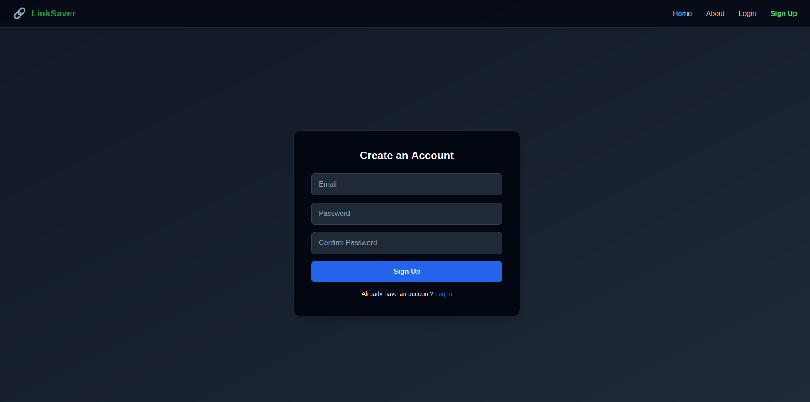
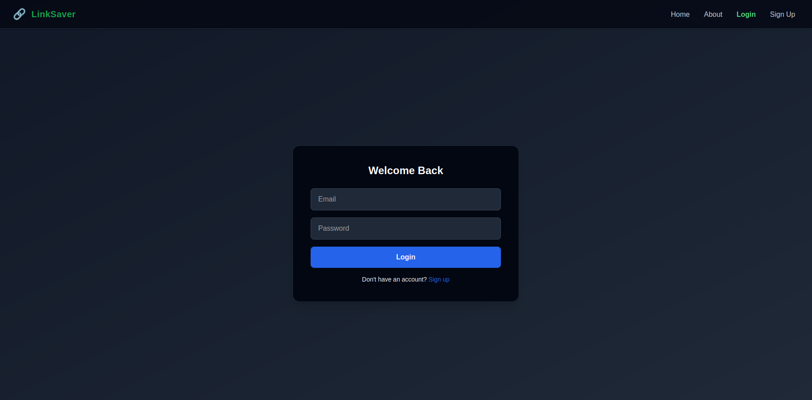
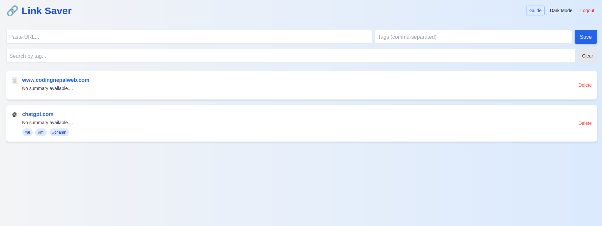
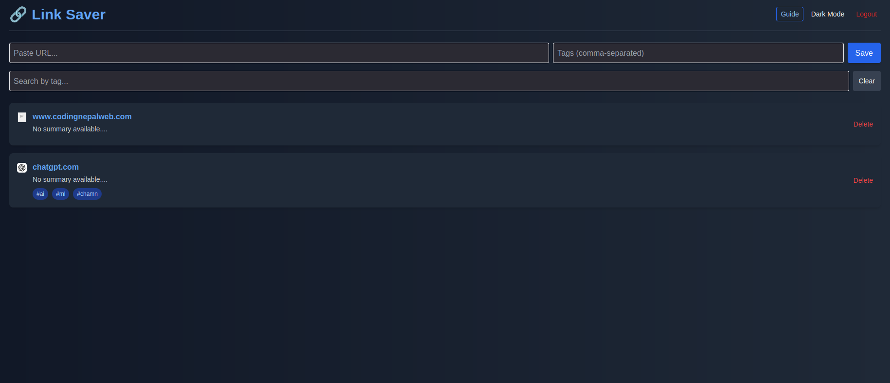

# Link Saver + Auto-Summary Web App

A full-stack productivity tool to save, manage, and auto-summarize bookmarks using Supabase, Next.js, TailwindCSS, and Jina AI.

## Live Demo

- Live Link: https://cerulean-crepe-ac4161.netlify.app
- GitHub Repo: https://github.com/Shrey7174/Link-Saver


## Tech Stack

| Layer        | Technology Used               |
|--------------|-------------------------------|
| Frontend     | Next.js, TailwindCSS          |
| Backend/Auth | Supabase (PostgreSQL + Auth)  |
| AI Summary   | Jina AI                       |
| DnD          | @hello-pangea/dnd             |
| Hosting      | Netlify                       |

## Features

- User authentication (Supabase)
- Save bookmarks with title, favicon, and summary
- Auto-generate summaries with Jina AI
- Add tags to bookmarks
- Filter/search by tags
- Drag-and-drop reorder
- Fully responsive design with dark mode

## Screenshots

> These images are located inside the `/images/` directory.

### Signup & Login

| Signup                             | Login                              |
|-----------------------------------|------------------------------------|
|           |             |

###  Dashboard (Bookmarks & Tag Filter)

| Light Mode                         | Dark Mode                          |
|-----------------------------------|------------------------------------|
|  |         |


## Project Structure

/pages → App routes (Next.js)
/components → Reusable components
/lib → Supabase and utility functions
/styles → Tailwind styling


## 🛠️ Setup (Local Development)

### 1. Clone the repo

```bash
git clone https://github.com/your-username/link-saver-app.git
cd link-saver-app
```

### 2. Install dependencies

```bash
npm install
```

### 3. Add environment variables

```bash
touch .env.local
```

Then open `.env.local` and add:

```bash
NEXT_PUBLIC_SUPABASE_URL=your-url
NEXT_PUBLIC_SUPABASE_ANON_KEY=your-anon-key
```

### 4. Run the app

```bash
npm run dev
```

## What I'd Do Next

- Add social login (Google, GitHub)
- Export/import bookmark list
- Add preview card (image, site info)
- Improve AI summary fallback with OpenAI
- Enable team/workspace-based sharing

## Time Spent

#| Task                  | Duration   |
| --------------------- | ---------- |
| Supabase Integration  | 1 hr       |
| Link CRUD + Summaries | 2 hrs      |
| UI + Drag & Drop      | 3 hrs      |
| Testing & Cleanup     | 2 hrs      |
| Deployment + Docs     | 3 hrs      |
| **Total**             | **11 hrs** |


## Notes

    Fully functional and deployed on Netlify for production use.

    Responsive, user-friendly interface built with modern frameworks.

    Readable, modular code structure suitable for teams.


## 🧑‍💻 Author

  Shreyansh
  